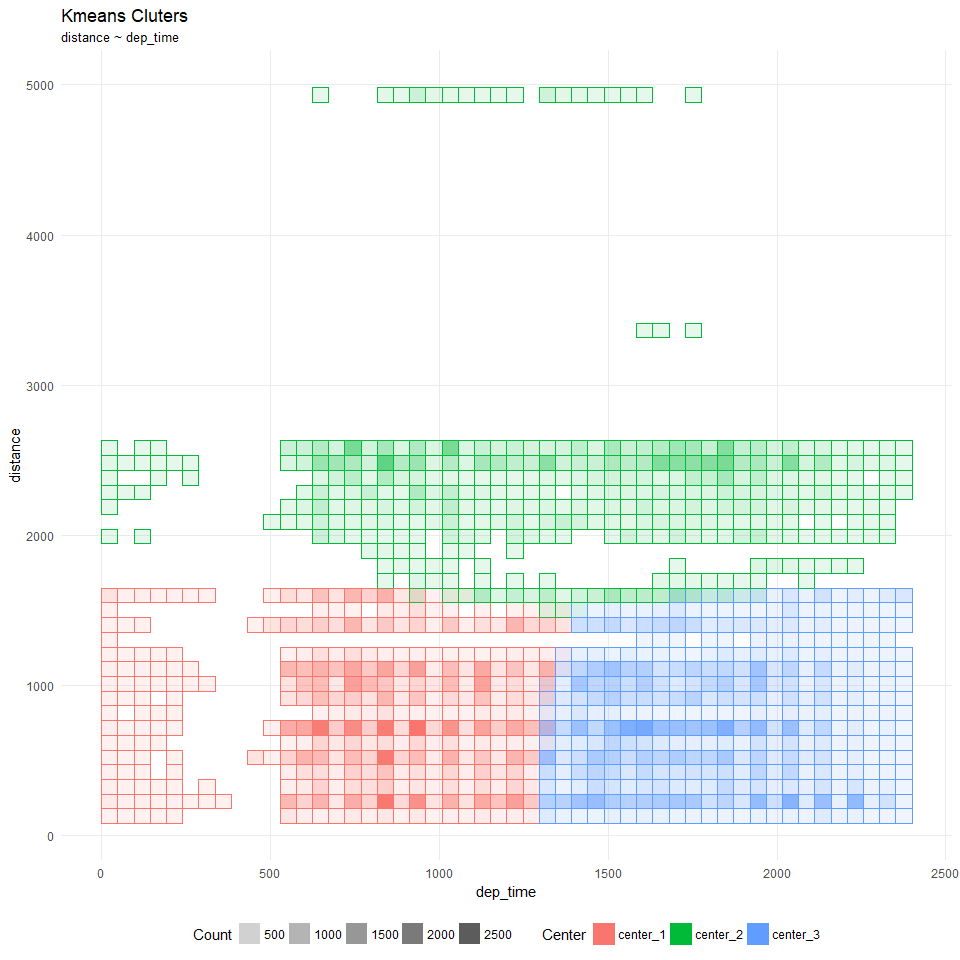
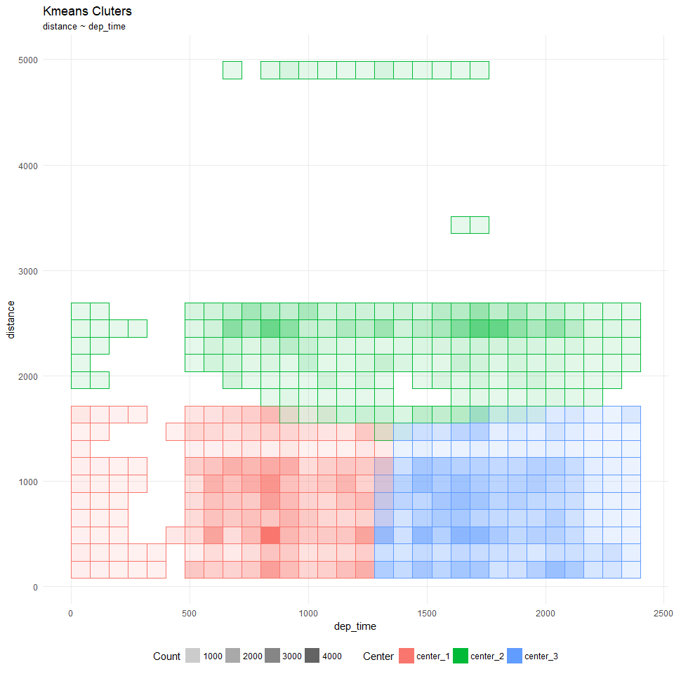

modeldb
================

Uses ‘dplyr’ and ‘tidyeval’ to enable model fitting inside the database.
It currently supports only **Kmeans Clustering**.

## Example setup

In this example, a simple `RSQlite` database will be use to load the
`flights` data from the `nycflights13` library.

``` r
library(tidyverse)

con <- DBI::dbConnect(RSQLite::SQLite(), path = ":memory:")
RSQLite::initExtension(con)

db_flights <- copy_to(con, nycflights13::flights, "flights")
```

## Running Kmeans clustering

The function `simple_kmeans()` can use with local data, or a remote
table, such as the `db_flights` variable that is a pointer to the
“flights” table inside the SQLite database. When piping to the
function, the only other required arguments are two or more fields
separated by comma. Because it uses ‘tidyeval’, the variable name
auto-completion will work.

``` r
library(modeldb)

km <- db_flights %>%
  simple_kmeans(dep_time, distance)
```

The `simple_kmeans()` function uses a progress bar to show you the
current cycle, the maximum cycles it’s expected to run, the current
difference between the previous cycle and the current cycle, and the
running time. The loop will stop once it wither has two matching
consecutive cycles, or if it reaches the maximum number of cycles, as
determined by the `max_repeats` argument.

The final **centers** are are stored in the `centers` variable of the
returned object

``` r
km$centers
```

    ## # A tibble: 3 x 2
    ##   dep_time distance
    ##      <dbl>    <dbl>
    ## 1     890.     791.
    ## 2    1391.    2355.
    ## 3    1746.     718.

The latest results are stored in the `tbl` variable of the returned
object. The type of the returned table will match the type of the
original source, so if it is a remote source, such as database table,
then `tbl` will be a class `tbl_sql`. This will allow us to do two
thing:

  - View the actual results by running the query via R. This will allow
    us to perform further operations if needed:

<!-- end list -->

``` r
head(km$tbl, 10)
```

    ## # Source:   lazy query [?? x 3]
    ## # Database: sqlite 3.19.3 []
    ##    dep_time distance center  
    ##       <int>    <dbl> <chr>   
    ##  1      517    1400. center_1
    ##  2      533    1416. center_1
    ##  3      542    1089. center_1
    ##  4      544    1576. center_1
    ##  5      554     762. center_1
    ##  6      554     719. center_1
    ##  7      555    1065. center_1
    ##  8      557     229. center_1
    ##  9      557     944. center_1
    ## 10      558     733. center_1
    ## # ... with more rows

  - View the SQL statement that was used to find the final centers:

<!-- end list -->

``` r
dbplyr::remote_query(km$tbl)
```

    ## <SQL> SELECT `dep_time`, `distance`, `center`
    ## FROM (SELECT `dep_time`, `distance`, `center_1`, `center_2`, `center_3`, CASE
    ## WHEN (`center_1` >= `center_1` AND `center_1` < `center_2` AND `center_1` < `center_3`) THEN ('center_1')
    ## WHEN (`center_2` < `center_1` AND `center_2` >= `center_2` AND `center_2` < `center_3`) THEN ('center_2')
    ## WHEN (`center_3` < `center_1` AND `center_3` < `center_2` AND `center_3` >= `center_3`) THEN ('center_3')
    ## END AS `center`
    ## FROM (SELECT `dep_time`, `distance`, SQRT(((889.757881651311 - `dep_time`) * (889.757881651311 - `dep_time`)) + ((791.286862996562 - `distance`) * (791.286862996562 - `distance`))) AS `center_1`, SQRT(((1391.08534916316 - `dep_time`) * (1391.08534916316 - `dep_time`)) + ((2355.04462033144 - `distance`) * (2355.04462033144 - `distance`))) AS `center_2`, SQRT(((1745.74853136521 - `dep_time`) * (1745.74853136521 - `dep_time`)) + ((718.043515631104 - `distance`) * (718.043515631104 - `distance`))) AS `center_3`
    ## FROM (SELECT *
    ## FROM (SELECT `dep_time`, `distance`
    ## FROM `flights`)
    ## WHERE (NOT(((`dep_time`) IS NULL)) AND NOT(((`distance`) IS NULL))))))
    ## WHERE (NOT(((`center`) IS NULL)))

## Under the hood

The `simple_kmeans()` function uses `dplyr` and ‘tidyeval’ to run the
KMeans algorithm. This means that when combined with `dbplyr`, the
routines can be run inside a database.

Unlike other packages that use this same methodology, such as `dbplot`
and `tidypredict`, `simple_kmeans()` does not create a single `dplyr`
code that can be extracted as SQL. The function produces multiple,
serial and dependent SQL statements that run individually inside the
database. Each statement uses the current *centroids*, or centers, to
estimate new centroids, and then it uses those centroids in a
consecutive SQL statement to see if there was any variance. Effectively,
this approach uses R not only as translation layer, but also as an
orchestration layer.

## Safeguards for long running jobs

The`simple_kmeans()` approach of using multiple and consecutive SQL
queries to find the optimal centers, additionally, in KMeans clustering,
it matters the order in which the each set of centers is passed. This
creates an imperative to find a way to cache the current centers used in
a long running job, in case the job is canceled or fails. Starting from
the centers that were calculated last, will mean that re-starting the
job will not being from “0”, but from a more advanced, read closer, set
of centers.

The safeguard implemented in this function is trough a file, called
*kmeans.csv*. Each cycle will update the file. The file name can be
changed by modifying the `safeguard_file` argument. Setting the argument
to NULL will turn off the safeguard.

In this example we will set the `max_repats` to 10, so as to
artificially avoid finding the optimal means

``` r
km <- db_flights %>%
  simple_kmeans(dep_time, distance, max_repeats = 10)
```

In the next run, the “kmeans.csv” file is passed as the `initial_kmeans`
argument. This will make `simple_kmeans()` use those centers as the
starting point:

``` r
km <- db_flights %>%
  simple_kmeans(dep_time, distance, initial_kmeans = read_csv("kmeans.csv"))
```

    ## Parsed with column specification:
    ## cols(
    ##   dep_time = col_double(),
    ##   distance = col_double()
    ## )

The second run took 7 cycles to complete, which adds up to the 17 cycles
that it initially took in the first example at the top of this article.

## Visualizations

Because visualizing a large amount of data may be both compute intensive
and visually challenging. The `modeldb` package offers a helper function
to aid with this task.

The `plot_kmeans` function uses ‘ggplot2’ to display the results of a
KMeans routine. Instead of a scatterplot, it uses a square grid that
displays the concentration of intersections per square. The number of
squares in the grid can be customized for more or less fine grain.

For large result-sets in remote sources, downloading every intersection
will be a long running, costly operation. The approach of this function
is to divide the x and y plane in a grid and have the remote source
figure the total number of intersections, returned as a single number.
This reduces the granularity of the visualization, but it speeds up the
results.

The calculation operations will take place inside the database. It
requires a database that supports functions like **MIN**, which SQLite
does not support, so for this example, we will collect the data into R
first (please do not use this step if working with a enterprise grade
database)

``` r
km$tbl <- collect(km$tbl) # ONLY USE THIS STEP IF WORKING WITH SQLITE
```

``` r
km$tbl %>%
  plot_kmeans(dep_time, distance)
```

<!-- -->

Reduce the resolution for faster results and larger squares:

``` r
km$tbl %>%
  plot_kmeans(dep_time, distance, resolution = 30)
```

<!-- -->
